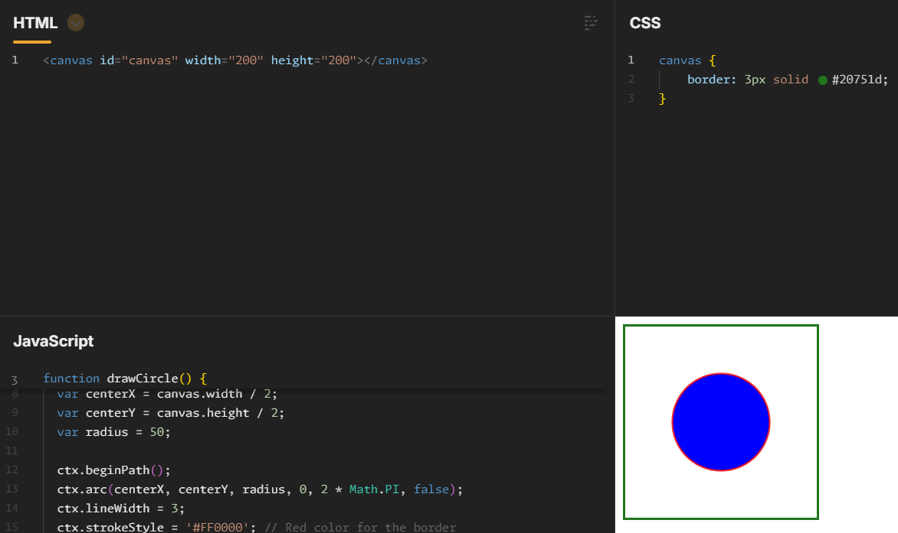
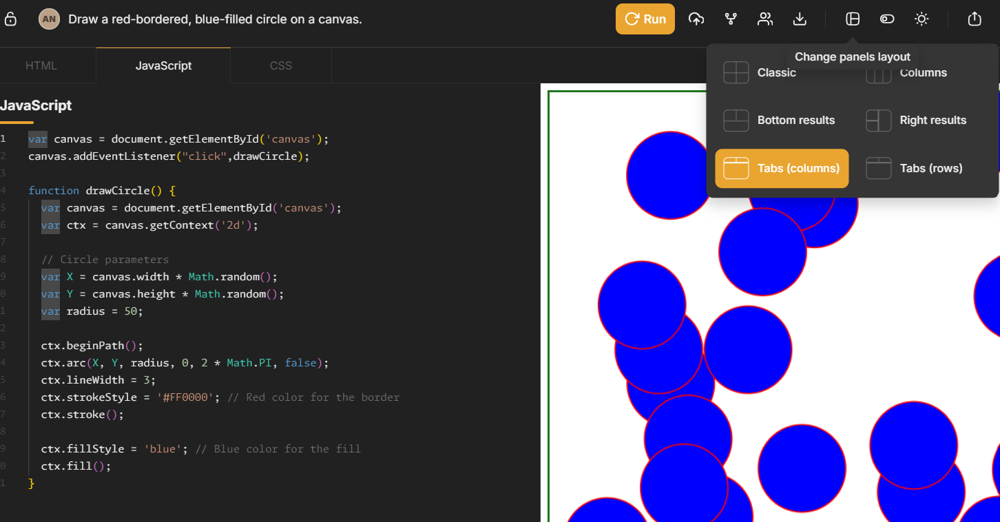
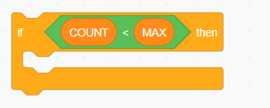
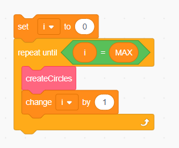

# Creating an HTML/Javascript Game

## Step 1

First we're going to create a circle on an HTML canvas.

Click on the jsfiddle link:
[jsfiddle example](https://jsfiddle.net/d950m142/2/)

The html panel contains
```
<canvas id="canvas" width="200" height="200"></canvas>
```

When the html script is loaded, it runs the javascript
The javascript function draws a circle with a radius of 50, and at a position in the middle of the canvas.

## Step 2

Add a border using CSS - this is used to style HTML pages.

Paste the below code into the CSS panel in JSFiddle

```
canvas {
    border: 3px solid #ccc;
}
```

Press run, you should see a border drawn around your canvas!

#ccc represents the colour of the border - it should be a light gray

Change this to your own colour (if you click on the small gray circle next to #ccc you will get a colour picker).

Don't forget to press run to see the change!



## Step 3

Change the width and height of the <b>canvas</b> - have a look at the html code, and see if you can make the canvas three times as big!

## Step 4

Make the circle appear in a random place in the canvas.
The javascript function <b>Math.random()</b> will gives a random value between 0 and 1.

The centre of the circle is set using <b>X</b> and <b>Y</b>

Change the part of the code that sets X and Y like this:

``
  var X = canvas.width * Math.random();
  var Y = canvas.height * Math.random();
``

Try pressing Run several times and see what happens!


## Step 5

Instead of having to re-run the page, let's draw a new circle when you click on the canvas!

We need to add an event listener which listens to the "click" event, and calls a function.

Instead of drawing a circle when the page is loaded, we'll add these two lines to the top of the Javascript:

```
var canvas = document.getElementById('canvas');
canvas.addEventListener("click",drawCircle);
```

To make it a bit easier to see, you can change the panel layout of JsFiddle to <b>tabs</b> like this:



When you click on the canvas you should see lots of circles appearing!

## Step 6

Now we're going to set up some variables to keep track of where the circles are, and what size they are.

This will come in handy later!

Add these three lines to the top of the javascript:

```
var circles = [];
var COUNT = 0;
var MAX = 4;
```

This is going to create some <b>variables</b>:

* <b>circles</b> - an <b>array<b> to track every circle on the page (an array is like a list in scratch)
* <b>COUNT</b> - the number of circles on the page
* <b>MAX</b> - the maximum number of circles allowed on the page

Now in the draw function code we need to add some code to <b>count</b> the number of circles we drew.
And stop you drawing too many circles!

Change the drawCircles() function to put and <b>IF</b> block around it - in javascript the curly braces go around a block of code

if (COUNT < MAX) { }

is the same as:




```
function drawCircle() {

  if (COUNT < MAX) {
  COUNT++;
  var canvas = document.getElementById('canvas');
  var ctx = canvas.getContext('2d');

  // Circle parameters
  var X = canvas.width * Math.random();
  var Y = canvas.height * Math.random();
  var radius = 50;
  circles.push({X,Y,radius});

  ctx.beginPath();
  ctx.arc(X, Y, radius, 0, 2 * Math.PI, false);
  ctx.lineWidth = 3;
  ctx.strokeStyle = '#FF0000'; // Red color for the border
  ctx.stroke();

  ctx.fillStyle = 'blue'; // Blue color for the fill
  ctx.fill();
  }
}
```

Here is an example [jsfiddle example](https://jsfiddle.net/d950m142/5/)

Make sure that you can only create 4 circles!

## Step 7

Animate the circles!

We're going to make the circles get smaller - the <b>radius</b> of the circle controls it's size.

To make the circles get smaller we need to clear the canvas and re-draw each circle, with a smaller radius

Let's split up the code that creates the circles and the code that draws the circles - so this is what our Javascript looks like - replace everything you have in the javascript panel with this script:

```
var circles = [];
var COUNT = 0;
var MAX = 4;

var canvas = document.getElementById('canvas');
var ctx = canvas.getContext('2d');
canvas.addEventListener("click",createCircle);

function createCircle() {

  if (COUNT < MAX) {
  COUNT++;

  // Circle parameters
  var X = canvas.width * Math.random();
  var Y = canvas.height * Math.random();
  var radius = 50;
  circles.push({X,Y,radius});
  drawCircle(X,Y,radius);
  }
}

function drawCircle(X,Y,radius) {

  ctx.beginPath();
  ctx.arc(X, Y, radius, 0, 2 * Math.PI, false);
  ctx.lineWidth = 3;
  ctx.strokeStyle = '#FF0000'; // Red color for the border
  ctx.stroke();

  ctx.fillStyle = 'blue'; // Blue color for the fill
  ctx.fill();
}
```

Now we'll change the script so that we can update the size of the cirles and re-draw them

Add this code onto the end:

```
function update(circle) {
if (circle.radius>10) {
  circle.radius--;
  drawCircle(circle.X, circle.Y, circle.radius);
}
}

function animate(timestamp) {
  ctx.clearRect(0, 0, canvas.width, canvas.height);
  circles.forEach(update);
  requestAnimationFrame(animate);
}

animate();
```

The animate function will clear the canvas, and then check every circle in our circles <b>array</b> and update it.

The update function decreases the <b>radius</b> of the circle <i> to make it smaller</i>

If the circle is smaller than 10 pixels it won't draw it.

You can still only create 4 circles, even when they have all disappeared.

Here is an example [jsfiddle example](https://jsfiddle.net/xq41u0af/)

As you click more circles appear, but there are still only 4 at once on the screen

## Step 8

When a circle becomes too small, let's move it to another random location, we'll create a move function

```
function move(circle) {

  circle.X = canvas.width * Math.random();
  circle.Y = canvas.height * Math.random();
  circle.radius = 50;
}
```

Now in the update circle function, we'll add an <b>else</b> block to move circles that are too small

```
function update(circle) {
if (circle.radius>10) {
  circle.radius--;
  drawCircle(circle.X, circle.Y, circle.radius);
}
else {
  move(circle);
}
}
```

Here is an example [jsfiddle example](https://jsfiddle.net/xq41u0af/1/)

## Step 9

Instead of waiting for a click, let's put all the circles on the screen when the page loads

We'll create a for loop at the beginning of the code to call <b>createCircle</b> MAX times

  for (var i=0; i< MAX; i++) {
    createCircle();
  }

  This is like the scratch block
  


## Step 10

Let's randomize the <b>radius</b> of the circles - this is currently set to 50 pixels in two places <b>createCircles</b> and <b>move</b>

We'll change radius=50 to a random radius between 50 and 100

```
  // In createCircles
  var radius = (100*Math.random())+50;

  // In move
  circle.radius = (100*Math.random())+50;
```

## Step 11

Let's create a score
In the HTML panel add a new element to contain the score

```
<div id="score">score 0</div>
<canvas id="canvas" width="600" height="600"></canvas>
```

## Step 12

We'll change the eventListener, so that instead of creating a circle when we click, it will increase the score

Create a new variable for our score

```
var SCORE = 0;
```

And then create a new function to set the score

```
function score() {
  SCORE++;
  var scr = document.getElementById('score');
  scr.innerHTML="score "+SCORE;
}
```

Change the function in our event listener to call the score function on "click"

```
canvas.addEventListener("click",score);
```

Here is an example [jsfiddle example](https://jsfiddle.net/xq41u0af/2/)

## Step 13

Actually let's check if we clicked in a circle before we increase the score!

We'll change the score function to check the distance between our mouse click, and the centre of the circle. 
If it's less than the radius of the circle, then we clicked in the circle!

```
function score(event) {
  // Get click position relative to the canvas
  const rect = canvas.getBoundingClientRect();
  const clickX = event.clientX - rect.left;
  const clickY = event.clientY - rect.top;

  circles.forEach( function(circle) {

  // Calculate the distance between the click and the centre of the circle
    var distance = Math.sqrt((circle.X-X)**2 + (circle.Y-Y)**2);
  
  // Move the circle, and increase the score
    if (distance < circle.radius) {
      move(circle);
        SCORE++;
        var scr = document.getElementById('score');
        scr.innerHTML="score "+SCORE;
    }

  });
}
```
## Step 14

Try changing the colour of the circles!

Have a look at the final project here [jsfiddle example](https://jsfiddle.net/xq41u0af/4/)

